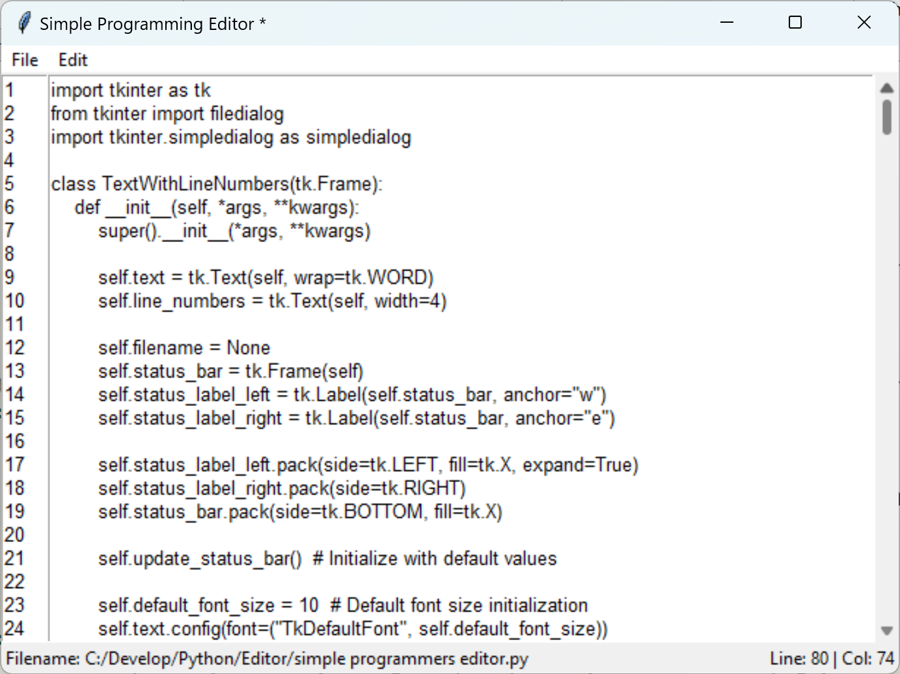
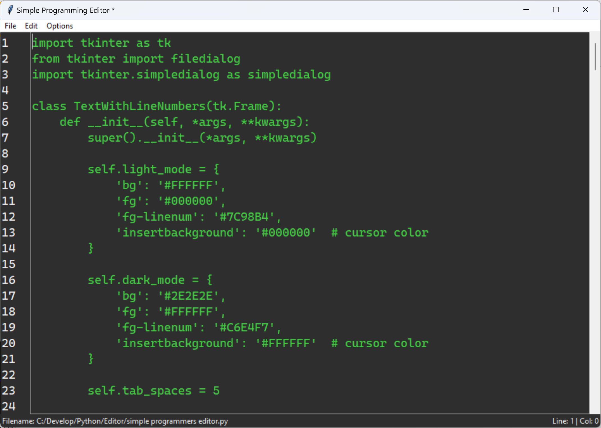
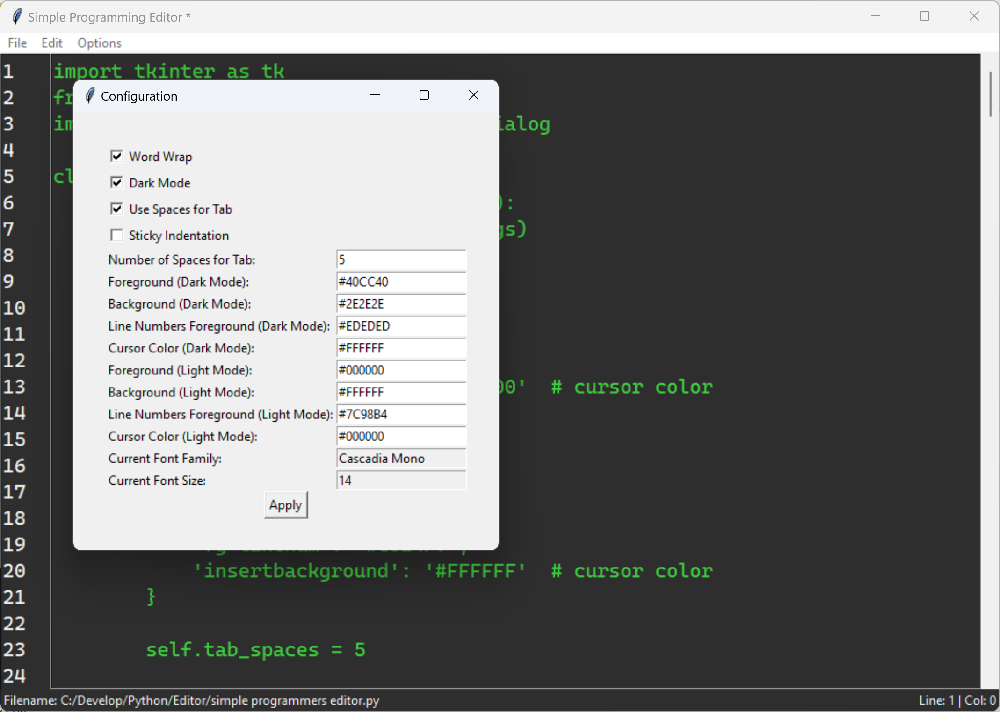
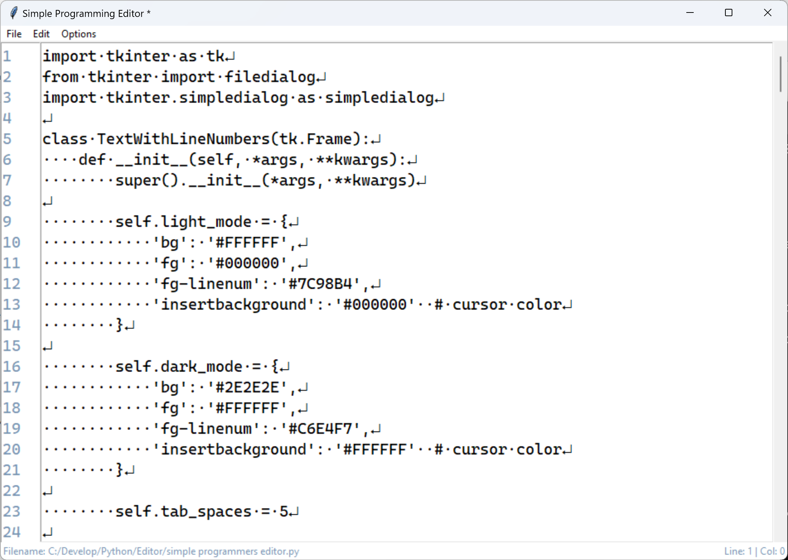
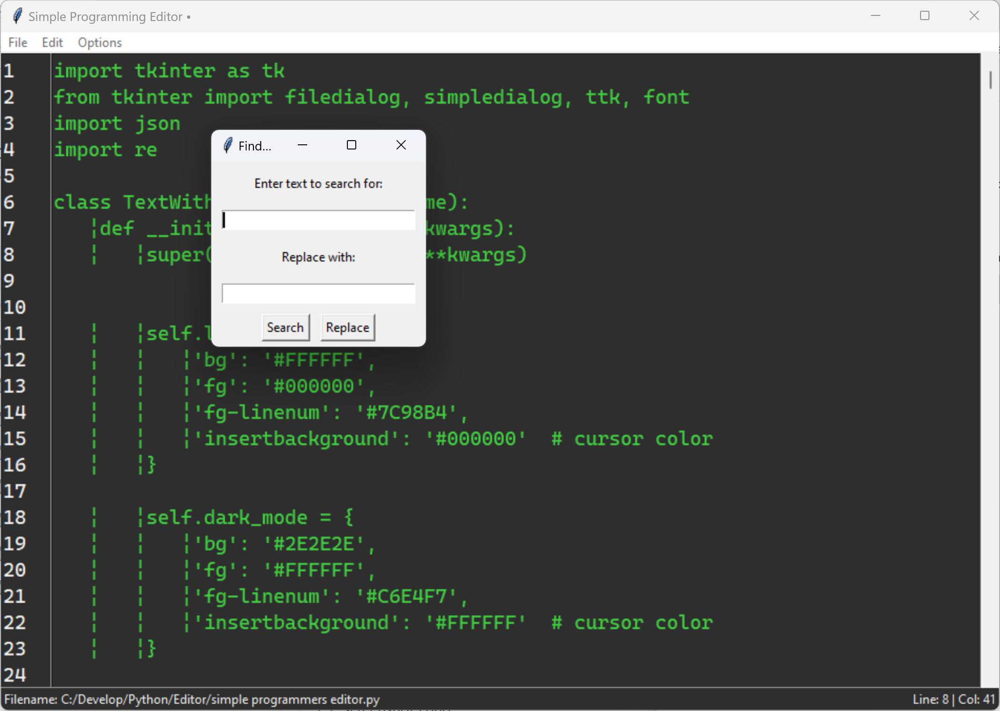

# SimpleProgrammersEditor
### A very simple editor for programming, written in Python 3 using tkinter.  Features line numbering, column and line tracking and simple editor features.
This editor has no dependencies that are not part of Python 3.x.  

There is a windows binary available (built with PyInstaller) which you can download and execute directly: [Download](https://github.com/bjazmoore/SimpleProgrammersEditor/releases/download/Editor/simple.programmers.editor.exe)

The source should run on Windows, Mac OS and Linux with a full installation of Python 3.x.  

### Light Mode:

### Dark Mode:

### Configuration Dialog (in Dark Mode):

### Display Indentation Enabled (in Dark Mode):

### Find and Replace (in Dark Mode):

Licensed MIT
