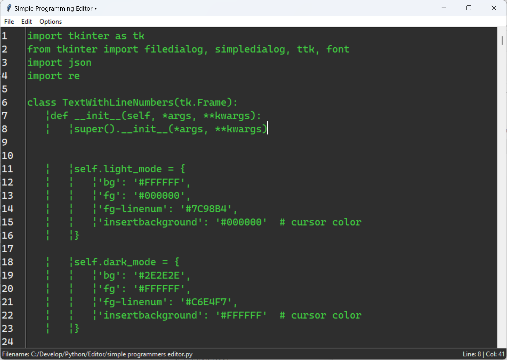

# SimpleProgrammersEditor
## A very simple editor for programming, written in Python 3 using tkinter.  Features line numbering, column and line tracking and simple editor features.
This editor has no dependencies that are not part of Python 3.x.  

### Light Mode:

### Dark Mode:

### Configuration Dialog (in Dark Mode):

### Display Indentation Enabled (in Dark Mode):

### Find and Replace (in Dark Mode):

Licensed MIT
